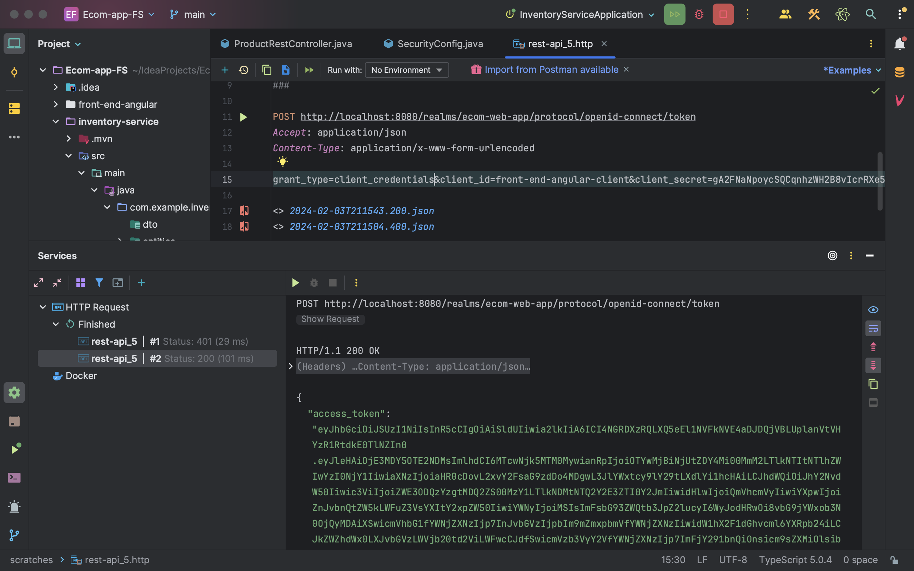
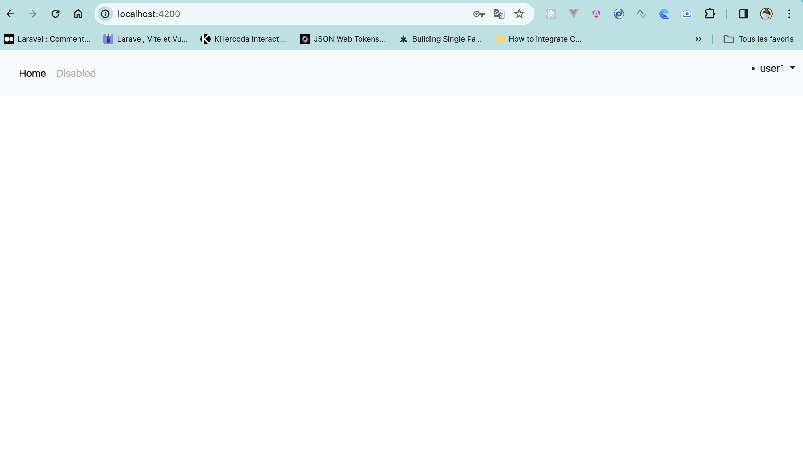

<h1>Ecom-app</h1>
<h1>Config Keycloack</h1>

.

.

.

.

.

.

Récuperation acces token par client secret

Exemple d'une authentification en tant que Admin

Login avec keycloack

Register 

<h2>Authentification double</h2>

L'authentification double à l'aide de l'application authenticator de google,qui permet de scanner le code QR

Code obtenu dans authenticator, on insere le code pour se connecter 

<h1>Accès à l'application </h1>

Accès du user qui a le role USER, en ce qui concerne la page produit seul le user authentifié comme Admin peut y acceder 

User2 ayant un role ADMIN

